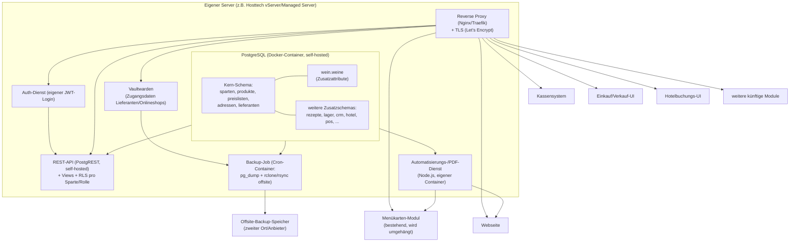
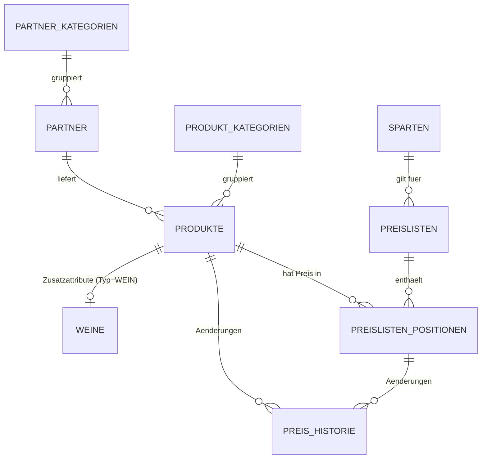

# Hoberg Gastro – Konzept für eine modulare Betriebssoftware

Status: Entwurf v3 | Datum: 2026-07-01

## 1. Ausgangslage

Hoberg betreibt mehrere Sparten unter einem Dach: Hotel, Restaurant, Catering,
Spezialitätenproduktion, Glaceherstellung, Störkoch. Ein erstes Modul
(Menükarten-System mit PDF-Export in CI und Web-Anzeige) existiert bereits
(Bolt.new). Ziel ist **keine Sammlung von Einzellösungen**, sondern ein System
mit **einer gemeinsamen Datenbasis**, auf die beliebig viele Module zugreifen –
neue Module sollen sich anschliessen lassen, ohne Daten zu duplizieren.

Erster konkreter Baustein: **Produktdatenbank Wein**, inkl. unterschiedlicher
Verkaufspreise pro Sparte (Restaurant, Catering, …) und einer sauberen
**Preis-Mutation** ausgehend von den Stammdaten.

**Zusätzliche Vorgabe:** Das gesamte System muss auf einem **eigenen Server**
(z. B. bei Hosttech) betrieben werden können – keine Abhängigkeit von einem
Cloud-Anbieter, der die Daten ausserhalb der eigenen Kontrolle hält. Inklusive
einer verlässlichen **Backup-Strategie für alle Daten, Tabellen und die
gesamte Datenbank** (siehe Abschnitt 12). Der ursprüngliche Ansatz
(Supabase als Cloud-Dienst) wird deshalb durch einen **self-hosted-Stack**
ersetzt, der auf jedem Linux-vServer/Managed-Server mit Root-Zugriff läuft –
funktional bleibt das Konzept (Stammdaten, Sparten, Preislisten, Module)
unverändert, nur die Betriebsumgebung ändert sich.

> **Empfehlung für das konkrete Hosttech-Produkt** (Entscheidung noch offen,
> daher hier begründet vorgeschlagen): ein **Hosttech vServer/Cloud Server
> mit vollem Root-Zugriff** (nicht der "Managed vServer" ohne Root, und nicht
> klassisches Shared-Webhosting). Gründe:
> - Nur mit Root-/SSH-Zugriff lassen sich Docker, PostgreSQL und eigene
>   Hintergrunddienste (API, Auth, Automatisierung) überhaupt betreiben.
>   Klassisches Shared-Hosting (PHP/MySQL über Plesk) und der "Managed
>   vServer" von Hosttech (System wird von Hosttech verwaltet, Root-Zugriff
>   bewusst deaktiviert) scheiden damit aus.
> - Hosttech-vServer laufen im eigenen ISO-27001-zertifizierten Rechenzentrum
>   (DATAROCK) mit voller Betriebssystemwahl (Linux) – passend für einen
>   Docker-Compose-Stack.
> - Hosttech erstellt für vServer standardmässig automatisch **tägliche
>   Voll-Backups mit 7 Tagen Aufbewahrung**, zusätzlicher Backup-Speicher ist
>   dazubuchbar. Das ist ein sinnvoller **zusätzlicher** Baustein, ersetzt
>   aber die eigene Offsite-Sicherung aus Abschnitt 12 nicht (liegt sonst auf
>   derselben Infrastruktur wie die Live-Daten – kein Schutz bei
>   Anbieterausfall).
> - **Bestellt** (siehe 12.4): 6 vCPU / 8 GB RAM / 200 GB NVMe-SSD, Aggressive
>   Powermode, Ubuntu 24.04 LTS minimal, kein System Management (voller
>   Root-Zugriff erhalten), 100 GB Backupspeicher, Serverstandort Schweiz,
>   12 Monate Laufzeit, CHF 54.80/Monat. Grösser als die ursprünglich
>   skizzierte Startgrösse ("Foggy", 4 vCPU/4 GB/100 GB) – zusätzliche
>   Reserve für Postgres + PostgREST + Auth-Dienst + Nginx + Coolify im
>   Parallelbetrieb. Lässt sich jederzeit ohne Datenmigration weiter
>   hochstufen (Details Abschnitt 12.1) – genaue Tarife/Namen bitte aktuell
>   im [Serverkonfigurator](https://www.hosttech.ch/serverkonfigurator/)
>   prüfen, da sich Staffelungen ändern können.
>
> Sollte stattdessen nur klassisches Shared-Hosting verfügbar sein (kein
> Root, kein Docker), müsste der technische Unterbau grundlegend auf
> PHP/MariaDB umgebaut werden – bitte in dem Fall Rückmeldung geben.

## 2. Architekturprinzipien

1. **Stammdaten-first, Single Source of Truth** – ein Produkt (z. B. ein Wein)
   existiert genau einmal in der Datenbank. Module lesen/verändern diese
   Stammdaten, sie duplizieren sie nicht.
2. **Sparte ist ein Attribut, keine eigene Datenbank.** Hotel, Restaurant,
   Catering usw. sind Werte einer `sparten`-Tabelle, keine getrennten Systeme.
   Das erlaubt sparten-spezifische Preise/Sichtbarkeit bei gemeinsamen
   Produktdaten.
3. **API-first / Headless.** Jedes Modul (inkl. bestehendes Menükarten-Tool,
   künftige Website, Kassensystem) spricht über eine gemeinsame, selbst
   gehostete REST-API mit der Datenbank. Kein Modul hält eigene Kopien von
   Produkt- oder Preisdaten.
4. **Erweiterbar statt starr.** Neue Produktarten (Speisen, Zutaten,
   Glaceartikel, Handelswaren) hängen sich als **Zusatztabellen** an eine
   generische `produkte`-Kerntabelle – analog zum Wein-Beispiel. Neue Module
   docken an dieselben Kern-Entitäten (Produkte, Preislisten, Adressen,
   Sparten) an.
5. **Jede Preisänderung ist nachvollziehbar.** Mutationen an Einkaufs- oder
   Verkaufspreisen werden protokolliert (wer, wann, alt → neu, warum),
   nicht überschrieben.
6. **Automatisierung über Events/Views, nicht über Spezialcode pro Modul.**
   Schnittstellen (POS, Website, Buchungsportale) docken über klar definierte
   Views, Funktionen und Webhooks an – das ist die Grundlage, um später
   Bereiche automatisiert zu verknüpfen (z. B. Lagerbestand → Bestellvorschlag,
   Kassenumsatz → Lagerabgang).

## 3. Modulübersicht

Alle Module teilen sich den Kern (Stammdaten, Produkte, Preislisten, Adressen,
Sparten). Die Tabelle zeigt, welche Kern-Entitäten jedes Modul nutzt bzw.
erweitert.

| Modul | Zweck | nutzt Kern-Entitäten | eigene Zusatzdaten (Beispiele) |
|---|---|---|---|
| **Stammdaten** (Kern) | zentrale Wahrheit für Produkte, Sparten, Partner (Lieferanten/Kunden/Dienstleister) | – | Sparten, Kategorien, Einheiten, MwSt-Sätze |
| **Produktverwaltung** | Erfassung/Pflege aller Artikel (Wein, Speisen, Zutaten, Glace, Handelsware) | Produkte | typ-spezifische Zusatztabellen (`weine`, später `speisen`, `glace_artikel`, …) |
| **Preislisten** | sparten-spezifische Verkaufspreise, automatische Ableitung aus Kalkulation | Produkte, Sparten | Preislisten, Preislistenpositionen, Preis-Historie, Kalkulationsregeln |
| **Einkauf** | Bestellungen, Wareneingang, Einkaufspreise | Produkte, Partner (Rolle Lieferant) | Bestellungen, Bestellpositionen, Wareneingänge |
| **Verkauf** | Angebote, Rechnungen, Aufträge (Catering-Events, Bankette) | Produkte, Preislisten, Partner (Rolle Kunde) | Aufträge, Auftragspositionen, Rechnungen |
| **CRM / Adressverwaltung** | Kunden, Lieferanten, Interessenten, Kontakthistorie | Partner | Kontaktpersonen, Aktivitäten (Partner-Rollenflags decken Kunde/Lieferant/Dienstleister ab) |
| **Hotelbuchungen** | Zimmerverfügbarkeit, Reservationen | Partner (Rolle Kunde), Preislisten (Zimmerkategorien als Produkte) | Zimmer, Reservationen, Belegungspläne |
| **Rezeptverwaltung** | Rezepte, Kalkulation über Zutatenpreise | Produkte (als Zutaten) | Rezepte, Rezeptpositionen, Nährwert-/Allergenangaben |
| **Lagerbewirtschaftung** | Bestände, Inventur, Mindestbestände je Standort/Sparte | Produkte, Sparten | Lagerorte, Lagerbestände, Bewegungen |
| **Interne Kommunikation** | Aufgaben, Schichtinfos, Ankündigungen | Partner (Mitarbeitende, falls so geführt) | Nachrichten, Aufgaben |
| **Kassensystem-Anbindung** | Verkaufsdaten importieren, Preise exportieren | Produkte, Preislisten | Mapping-Tabelle POS-Artikel ↔ Produkt, Verkaufsbelege |
| **Webseitenverwaltung / Menükarten** | öffentliche Darstellung, PDF-Export (bereits vorhanden) | Produkte, Preislisten | Menüaufbau/Layout, CI-Vorlagen |
| **Automatisierung / Integration Hub** | Schnittstellen, Webhooks, wiederkehrende Jobs | alle | API-Keys, Webhook-Log, Job-Historie |

## 4. Systemarchitektur (High Level)

Alles läuft als **Docker-Compose-Stack auf einem einzigen (Hosttech-)Server**
– keine externen Cloud-Abhängigkeiten für Kerndaten:

Jedes Modul ist ein eigenes Frontend/Service, aber es gibt **eine** Datenbank
und **eine** API-Schicht, beide auf demselben Server. Damit landet z. B. eine
Preisänderung in den Stammdaten automatisch in Menükarte, Webseite und
(später) im Kassensystem – ohne manuellen Doppelaufwand. Der Server ist
bewusst so aufgebaut, dass ein Umzug auf einen anderen Hoster jederzeit
möglich bleibt (reines Docker Compose, keine proprietären Dienste).

## 5. Sparten-Konzept

`sparten` ist eine einfache Stammdatentabelle:

`HOTEL`, `RESTAURANT`, `CATERING`, `SPEZIALITAETEN`, `GLACE`, `STOERKOCH`
(erweiterbar, keine Codeänderung nötig für neue Sparten).

Ein Produkt (z. B. ein Wein) ist sparten-unabhängig in den Stammdaten erfasst.
Ob und zu welchem Preis es in einer Sparte erscheint, wird über eine
**Preisliste pro Sparte** gesteuert (siehe Abschnitt 7). So kann derselbe Wein:

- im Restaurant zu CHF 39.– im Glas/Flasche erscheinen,
- im Catering zu einem Pauschal-/Mengenpreis,
- im Hotel z. B. gar nicht (weil nicht gelistet) –

ohne dass er drei separate Produktstämme braucht.

## 6. Datenbankkonzept

### 6.0 Abgleich mit realer Hoberg-Lieferantenliste

Die vorhandene Excel-Liste "Lieferanten" (Weine, Getränke allgemein,
Lebensmittel, Buchhaltung, Kassensystem, Hotel-Plattformen,
Reinigung/Wäscherei, Dienstleister) hat das Datenmodell an zwei Stellen
konkret geschärft:

1. **Lieferant und Kunde sind in der Praxis dieselbe Art von Datensatz.**
   Die Liste führt Firmen mit den Spalten "Kunde" und "Lieferant" als
   Rollen-Flags auf derselben Zeile (z. B. ist Booking.com kein
   Weinlieferant, sondern eine Buchungsplattform; die Reinigungsfirma ist
   Dienstleister, kein Wareneinkauf). Ursprünglich waren `core.lieferanten`
   (Phase 1) und eine CRM-Adresstabelle (Phase 3) getrennt geplant – das
   hätte dieselbe Firma doppelt erfasst und würde dem eigenen Prinzip
   "Single Source of Truth" widersprechen. **Anpassung:** ein gemeinsames
   Register `core.partner` mit Rollenflags `ist_kunde` / `ist_lieferant` /
   `ist_dienstleister` statt getrennter Tabellen pro Modul. Einkauf,
   Rezeptverwaltung und später CRM/Verkauf greifen alle auf dieselben
   Partner-Datensätze zu.
2. **Adressfelder differenzierter als ursprünglich angenommen:** Strasse und
   Hausnummer getrennt, PLZ/Ort getrennt, zusätzlich Land (in der Liste
   z. B. ein deutscher Lieferant), zwei Telefonnummern (Telefon/Mobil),
   eigene Ansprechperson (Vor-/Nachname), Kundennummer beim Lieferanten,
   Webseite, Online-Shop-URL und ein Feld für den bevorzugten Bestellkanal
   (online/E-Mail/Telefon) – alle jetzt in `core.partner` abgebildet
   (siehe `db/phase1_stammdaten_wein_preise.sql`).

**Sicherheitshinweis zu den Zugangsdaten:** Die Excel-Liste enthält für
einzelne Online-Shops Benutzername/Passwort im Klartext in einer eigenen
Spalte. Diese Klartext-Werte werden **nicht** in die Datenbank oder ins
Git-Repository übernommen. Im Modell gibt es dafür bewusst nur ein Flag
`zugangsdaten_hinterlegt` und einen Verweis `zugangsdaten_verweis` (z. B.
"Vaultwarden: Fischer Weine Onlineshop") – das eigentliche Passwort gehört
in einen separaten, dafür gebauten Passwort-Tresor, nicht in die
Geschäfts-DB und nicht in eine Excel-Datei. Empfehlung: **Vaultwarden**
(self-hosted, Bitwarden-kompatibel) als zusätzlichen Docker-Dienst auf dem
gleichen Server ergänzen (siehe Abschnitt 11) und die in der Liste
sichtbaren Klartext-Passwörter bei Gelegenheit ändern, da sie aktuell
unverschlüsselt in einer Excel-Datei kursieren.

### 6.1 Schema-Organisation

Postgres-Schemas trennen Fachbereiche, teilen sich aber Fremdschlüssel auf den
Kern:

- `core` – Sparten, Produkte, Kategorien, Partner (Lieferant/Kunde/
  Dienstleister), Preislisten, MwSt
- `auth` – Benutzer, Rollen, Rollenzuweisung je Sparte, 2FA (siehe 9.1/6.4)
- `wein` – Zusatzattribute für Produkte vom Typ `WEIN`
- `crm` – Kontaktpersonen, Aktivitäten/Historie zu `core.partner` (Phase 3,
  keine eigene Firmen-/Adresstabelle mehr – das ist bereits `core.partner`)
- `lager`, `einkauf`, `verkauf`, `rezepte`, `hotel`, `pos` – künftige Module,
  referenzieren `core.produkte` / `core.sparten` / `core.partner`

### 6.2 Namenskonventionen (verbindlich)

- Tabellen: `snake_case`, Plural (`produkte`, `preislisten`)
- Primärschlüssel: `id uuid default gen_random_uuid()`
- Fremdschlüssel: `<tabelle_singular>_id` (`produkt_id`, `sparte_id`)
- Zeitstempel: `created_at`, `updated_at` (immer `timestamptz`)
- Geldbeträge: `numeric(10,2)`, Währung separat vermerken (`waehrung`, default `CHF`)
- Jede fachliche Änderung an einem Preis läuft über eine Funktion/Trigger,
  **nie** durch stilles Überschreiben ohne Historieneintrag

### 6.3 Kern-ER-Diagramm

### 6.4 Kerntabellen (Phase 1 – siehe `db/phase1_stammdaten_wein_preise.sql`)

**`core.sparten`** – Betriebsbereiche (Hotel, Restaurant, Catering, …)

**`core.mwst_saetze`** – MwSt-Sätze mit Gültigkeitszeitraum (Sätze ändern
sich mit der Zeit, daher historisiert statt einfacher Prozentwert)

**`core.partner_kategorien`** – Kategorien für `core.partner`, direkt aus der
realen Hoberg-Lieferantenliste übernommen (Weine, Getränke, Lebensmittel,
Buchhaltung, Kassensystem, Hotel-Plattform, Reinigung/Wäscherei, Dienstleistung).

**`core.partner`** – gemeinsames Register für Lieferanten, Kunden und
Dienstleister (Rollenflags `ist_kunde`/`ist_lieferant`/`ist_dienstleister`
statt separater Tabellen, siehe 6.0). Enthält Adresse (Strasse/Nr./PLZ/Ort/
Land), Ansprechperson, Telefon/Mobil, E-Mail, Webseite, Kundennummer beim
Partner, Bestellkanal, Online-Shop-URL sowie nur einen **Verweis** auf
hinterlegte Zugangsdaten (kein Klartext-Passwort in der DB).

**`core.produkt_kategorien`** – hierarchische Kategorien
(`Getränke > Wein > Rotwein`)

**`core.produkte`** – generische Produkt-Stammdaten für **alle** Artikeltypen
(`produkt_typ` als Diskriminator: `WEIN`, `SPEISE`, `ZUTAT`, `HANDELSWARE`,
`GLACE`, …). Enthält Artikelnummer, Bezeichnung, Einkaufspreis,
Basis-Einheit, Lieferant, MwSt, Status.

**`wein.weine`** – 1:1-Zusatztabelle zu `core.produkte` für alle
Wein-spezifischen Felder: Rebsorte(n), Jahrgang, Land/Region/Appellation,
Winzer, Farbe, Flascheninhalt, Alkoholgehalt, Süssegrad, Bio-Zertifizierung,
Allergene/Sulfite, Verkostungsnotiz, Trinktemperatur, Lagerfähigkeit.

→ **Muster für alle künftigen Produktarten**: neue Sparte/Produktart = neue
Zusatztabelle mit `produkt_id` als PK/FK, niemals eine Kopie von `produkte`.

**`core.preislisten`** – Preisliste pro Sparte mit Gültigkeitszeitraum und
Status (`ENTWURF`, `AKTIV`, `ARCHIVIERT`). Beispiel: "Weinkarte Restaurant
2026", "Preisliste Catering Sommer 2026".

**`core.preislisten_positionen`** – Verkaufspreis eines Produkts in einer
Preisliste, mit eigenem Gültigkeitszeitraum (→ Mutationen ohne Datenverlust:
alte Zeile bekommt `gueltig_bis`, neue Zeile wird eingefügt).

**`core.preis_historie`** – Audit-Log **jeder** Preisänderung
(Einkaufspreis in den Stammdaten **und** Verkaufspreise in Preislisten):
alter Wert, neuer Wert, wer, wann, Grund. Wird per Trigger automatisch
befüllt – Mutation ist damit strukturell erzwungen, nicht optional.

**`auth.rollen`** – Rollen (z. B. `ADMIN`, `PREISLISTEN_FREIGABE`,
`EINKAUF`, `SPARTEN_LESER`, `SERVICE_ACCOUNT`) mit Flag `erfordert_2fa`.

**`auth.benutzer`** – Mitarbeitende-Logins mit Passwort-Hash sowie
`zwei_faktor_aktiv` und dem **verschlüsselt** abgelegten TOTP-Secret
(nie im Klartext, siehe 9.1).

**`auth.benutzer_rollen`** – Zuordnung Benutzer ↔ Rolle, optional
eingeschränkt auf eine `sparte_id` (z. B. "Preislisten-Freigabe nur für
Catering"; `sparte_id = null` heisst alle Sparten).

**`auth.zwei_faktor_backup_codes`** – gehashte Einmal-Codes pro Benutzer
für den Fall eines verlorenen 2FA-Geräts.

## 7. Preislogik im Detail (Wein-Beispiel)

1. **Einkaufspreis / Kalkulationsbasis** liegt in `core.produkte.einkaufspreis`
   – das ist der Stammdatenwert, den der Einkauf pflegt.
2. **Verkaufspreise pro Sparte** liegen in `core.preislisten_positionen`,
   je Sparte eine eigene aktive Preisliste. Ein Wein kann also gleichzeitig
   einen Restaurant-Preis und einen Catering-Preis haben, beide unabhängig
   voneinander veränderbar.
3. **Mutation:**
   - Ändert sich der Einkaufspreis in den Stammdaten → Trigger schreibt
     einen Eintrag in `core.preis_historie` und kann optional (Kalkulations-
     regel, z. B. Faktor 2.8 für Restaurant, Faktor 1.6 für Catering) einen
     **Preisvorschlag** für die betroffenen Preislisten-Positionen erzeugen.
   - Die eigentliche Übernahme des Vorschlags in die aktive Preisliste ist
     ein bewusster Freigabeschritt (kein automatisches Überschreiben von
     Kundenpreisen), wird aber ebenfalls historisiert.
4. **MwSt** wird pro Preislisten-Position referenziert (Restaurant vs.
   Take-away/Catering können unterschiedliche Sätze haben).
5. Dieses Muster (Stammpreis → sparten-spezifische Preisliste → Historie)
   gilt unverändert für alle künftigen Produktarten, nicht nur Wein.

## 8. Schnittstellen & Automatisierung

- **Interne API:** self-hosted REST-API (PostgREST) auf `core.*`-Tabellen
  und -Views, Zugriff über Row Level Security nach Sparte/Rolle gesteuert.
- **Bestehendes Menükarten-Modul (Bolt.new):** wird so umgehängt, dass es
  Produkte/Preise über die gemeinsame API aus `core.produkte` +
  `core.preislisten_positionen` liest statt eigene Daten zu halten. PDF- und
  Web-Ausgabe bleiben wie gehabt, nur die Datenquelle wird zentralisiert.
- **Kassensystem:** Mapping-Tabelle POS-Artikelcode ↔ `produkt_id`;
  Verkaufsbelege fliessen als Events zurück (Basis für spätere
  Lagerabgang-Automatisierung).
- **Automatisierungs-/Integrations-Hub:** Webhook-Log- und Job-Tabellen im
  Kern, damit neue Automatisierungen (z. B. "Preisliste PDF neu generieren,
  wenn sich eine Preislisten-Position ändert") einheitlich angebunden werden,
  statt pro Modul Spezialcode zu schreiben.

## 9. Rollen & Berechtigungen (Kurzform)

Rollenkonzept über eigenen Auth-Dienst (JWT-Login) + Postgres Row Level
Security, grob:

- **Stammdaten-Pflege** (Einkaufspreise, Produktdaten): Einkauf/Admin
- **Preislisten-Freigabe** (Verkaufspreise je Sparte): Sparten-Verantwortliche
- **Lesezugriff** je Modul/Sparte: entsprechendes Personal
- **Reine Leserechte** für Webseite/Kassensystem (technische Service-Accounts)

### 9.1 Zwei-Faktor-Authentifizierung (2FA)

- **Methode: TOTP** (zeitbasierter Einmalcode, RFC 6238) – kompatibel mit
  Standard-Apps wie Google Authenticator, Microsoft Authenticator oder
  Authy. Bewusst **kein SMS-2FA** (gilt als unsicherer, u. a. anfällig für
  SIM-Swapping).
- **Pflicht** für sicherheitskritische Rollen: Stammdaten-Pflege (Admin/
  Einkauf) und Preislisten-Freigabe. **Empfohlen** für alle übrigen
  Mitarbeitenden-Logins, **nicht** anwendbar auf technische
  Service-Accounts (Webseite/Kassensystem – dort greifen stattdessen enge
  API-Keys mit Leserecht statt eines Login mit 2FA).
- **Verlust des Geräts:** einmalige, gehashte **Backup-Codes** beim
  Einrichten der 2FA generieren (wie bei den meisten 2FA-Systemen üblich),
  damit ein Zugriff nicht komplett verloren geht.
- Das TOTP-Secret wird **verschlüsselt** in der Datenbank abgelegt (nie im
  Klartext) – gleiches Prinzip wie schon bei den Lieferanten-Zugangsdaten in
  Abschnitt 6.0. Die Durchsetzung "welche Rolle braucht 2FA" erfolgt im
  Auth-Dienst beim Login (Anwendungslogik), nicht als starrer
  Datenbank-Constraint, da sie mehrere Tabellen (Benutzer × Rollen)
  gleichzeitig betrifft.
- Siehe `auth`-Schema in Abschnitt 6.4 für die konkrete Tabellenstruktur.

## 10. Roadmap

0. **Phase 0 (Vorbereitung):** Server bei Hosttech einrichten (vServer/Managed
   Server, Root-Zugriff), Docker + Docker Compose, Firewall, TLS, Backup-Job
   gemäss Abschnitt 12 – **bevor** die erste Fachanwendung produktiv geht.
1. **Phase 1 (jetzt):** Kern-Stammdaten + Produktdatenbank Wein +
   Preislisten Restaurant/Catering + Preis-Historie (siehe SQL-Datei),
   lokal/auf Testserver aufsetzen und Backup-Restore einmal durchspielen.
2. **Phase 2:** Bestehendes Menükarten-Modul auf die neue Datenbank umstellen
   (statt Eigendaten), inkl. automatischem PDF-Export aus Preislisten.
3. **Phase 3:** Einkauf, Lager, CRM/Adressverwaltung.
4. **Phase 4:** Hotelbuchungen, Kassensystem-Anbindung, Rezeptverwaltung,
   interne Kommunikation.
5. **Laufend:** Automatisierungs-Hub ausbauen (Bestellvorschläge,
   Kassenabgleich, Website-Sync).

## 11. Technologie-Empfehlung (self-hosted)

Ziel: gleiche Vorteile wie ein Cloud-Backend (eine DB, automatisch generierte
API, Rollen/Rechte, Auth, Dateiablage, Automatisierung), aber **vollständig
auf dem eigenen Server** und ohne Bindung an einen einzelnen Anbieter:

| Baustein | Wahl | Begründung |
|---|---|---|
| Datenbank | **PostgreSQL** (Docker-Container) | identisch zum bisherigen Schema, keine Anpassung der SQL-Datei nötig, sehr gute Backup-Werkzeuge |
| API-Schicht | **PostgREST** (self-hosted, Open Source) | generiert automatisch eine REST-API aus dem Postgres-Schema inkl. Row Level Security – gleiches Prinzip wie zuvor, aber ohne Cloud-Anbieter |
| Auth | eigener, schlanker JWT-Auth-Dienst (Node.js) oder Postgres-Rollen direkt | reicht für Mitarbeitendenanzahl eines Betriebs dieser Grösse; Keycloak als Option, falls später viele Systeme/SSO gebraucht werden |
| Automatisierung/PDF | eigener **Node.js-Dienst** (Docker-Container) | übernimmt PDF-Erstellung (wie bisher im Menükarten-Modul), Webhooks, geplante Jobs |
| Reverse Proxy/TLS | **Nginx** oder **Traefik** + Let's Encrypt | ein Einstiegspunkt für alle Module, automatisches HTTPS-Zertifikat |
| Dateiablage (Bilder, PDFs) | lokales Docker-Volume, bei Bedarf später **MinIO** (self-hosted, S3-kompatibel) | einfach im Backup mit einzubeziehen, kein externer Objektspeicher nötig |
| Zugangsdaten/Passwörter (z. B. Online-Shop-Logins der Lieferanten) | **Vaultwarden** (self-hosted, Bitwarden-kompatibel), eigener Container | ersetzt Klartext-Passwörter in Excel/DB (siehe 6.0); `core.partner` verweist nur darauf, enthält das Geheimnis nicht |
| Deployment/Verwaltung | **Coolify** (self-hosted PaaS, Open Source) auf dem Hosttech-Server, orchestriert den Docker-Compose-Stack darunter | Web-Dashboard statt SSH/CLI für Deployments, Zertifikate, Logs, Umgebungsvariablen – deutlich einfachere Handhabung im Alltag, bleibt aber vollständig self-hosted |
| Backup | Coolifys eingebaute geplante DB-Backups auf **externen S3-kompatiblen Speicher** (z. B. Hetzner Storage Box, Backblaze B2) + Hosttechs Server-Backup als zweite Ebene | siehe Abschnitt 12 – Offsite-Regel wird durch die S3-Konfiguration praktisch automatisch erfüllt, Restore direkt im Dashboard testbar |
| Monitoring/Alarmierung | **Uptime Kuma** (self-hosted, einfach) oder Coolifys eigenes Monitoring | Ausfälle/Fehlschläge (auch von Backup-Jobs) fallen auf, bevor sie der Kunde merkt |

Das bestehende Bolt.new-Menükarten-Tool lässt sich darauf umstellen, ohne die
UI verwerfen zu müssen – nur die Datenquelle wechselt von "eigene
Cloud-Tabelle" zu "eigene PostgreSQL-Instanz über PostgREST".

**Geklärt: Wer pflegt die Basis (OS-Updates, Coolify-Updates, Alarme)?**
Bei Hosttech ist das kein Sowohl-als-auch: Die "Managed"-Angebote (Managed
Server/Managed vServer, 24/7-Betreuung durch Hosttech) laufen **ohne
Root-Zugriff** über ein Plesk-Panel für klassische PHP/MySQL-Anwendungen –
Docker, PostgreSQL, PostgREST und Coolify laufen dort **nicht**, weil dafür
Root nötig ist. Eine "Hosttech verwaltet, wir behalten unseren Stack"-Option
gibt es bei Hosttech nicht. Praktikabler Weg: Root-vServer bei Hosttech
(liefert Infrastruktur inkl. automatischem Hardware-Failover), und die
Software-Pflege wird entweder von uns übernommen **oder an einen externen
Managed-Ops-Dienstleister** vergeben, der auf diesem Root-Server arbeitet
(separater Dienstleister, nicht Hosttech). Diese Entscheidung (wer konkret)
sollte vor dem Produktivbetrieb getroffen werden.

Konkreter nächster Schritt (Programmierung, nach Freigabe dieses Konzepts):
Server-Grundgerüst (Coolify auf Hosttech-vServer, darunter Postgres +
PostgREST + Nginx + Backup-Job) aufsetzen und
`db/phase1_stammdaten_wein_preise.sql` als erste Migration einspielen.

## 12. Hosting & Backup-Konzept

### 12.1 Serveranforderungen

- Linux-Server mit vollem Root-/SSH-Zugriff (empfohlen: **Hosttech
  vServer/Cloud Server**, Linie "Foggy" als Startgrösse – 4 vCPU/4 GB RAM/
  100 GB NVMe-SSD – siehe Empfehlung in Abschnitt 1; **nicht** der "Managed
  vServer" ohne Root und nicht klassisches Shared-Hosting), Docker + Docker
  Compose installiert, darüber **Coolify** als Verwaltungsebene (Abschnitt 11).
- **Skalierbarkeit:** Hosttech erlaubt jederzeit ein Hochstufen auf die
  nächstgrössere vServer-Stufe im Kundencenter (mehr vCPU/RAM/SSD) **ohne
  Datenmigration** – lediglich ein geplanter Neustart zu einem gewählten
  Zeitpunkt. Zusätzlich lässt sich unabhängig davon der I/O-Modus von
  "Dynamic" (Standard) auf "Aggressive" (~4× mehr SSD-Durchsatz/IOPS)
  umstellen, jederzeit, ohne Stufenwechsel – erster Hebel, wenn die
  Datenbank unter Last spürbar langsamer wird, bevor man die ganze
  Server-Stufe wechselt.
- Hosttechs standardmässiges tägliches Voll-Backup (7 Tage Aufbewahrung) kann
  als zusätzliche Sicherheitsebene mitgebucht werden, ersetzt aber die
  eigene Offsite-Sicherung in 12.2 nicht. Für die Offsite-Kopie selbst bietet
  sich alternativ/ergänzend Hosttechs **"Backup & Protect"** an (Schweizer
  ISO-zertifiziertes Rechenzentrum, AES-256-verschlüsselt, KI-Malware-Schutz,
  ab CHF 4.90/Monat für 35 GB, grössere Stufen verfügbar) statt eines
  externen S3-Anbieters, falls die Daten lieber in der Schweiz bei Hosttech
  selbst bleiben sollen als bei einem Drittanbieter.
- Ausreichend Speicherplatz für Datenbank **und** Backups (Faustregel:
  mindestens das 3–4-fache der erwarteten DB-Grösse einplanen).
- **Monitoring:** Uptime Kuma (self-hosted) oder Coolifys Monitoring
  überwacht Erreichbarkeit der Dienste und Backup-Jobs, mit Alarmierung bei
  Ausfall. Ein Hosttech-eigenes Monitoring-Produkt gibt es nur im
  "Managed"-Tarif – der aber wie oben beschrieben keinen Root-Zugriff erlaubt
  und damit für unseren Stack nicht in Frage kommt.
- Firewall (nur Port 443/80 und SSH offen), SSH nur mit Schlüssel (kein
  Passwort-Login), automatische Sicherheitsupdates des Betriebssystems.
- Getrennte Umgebungen: mind. **Produktion**, empfohlen zusätzlich eine
  **Test-/Staging-Instanz** auf demselben oder einem separaten Server, um
  neue Module/Migrationen vorab zu prüfen.

### 12.2 Backup-Strategie (3-2-1-Prinzip)

**3 Kopien, 2 verschiedene Medien/Orte, 1 davon offsite:**

1. **Automatischer täglicher Dump** der gesamten PostgreSQL-Datenbank
   (`pg_dump` im Custom-Format, komprimiert), geplant über Coolifys
   eingebaute Backup-Funktion (native Dump-Routine je Datenbank, per
   Cron-Ausdruck konfigurierbar), inkl. Zeitstempel im Dateinamen.
2. **Dateiablage sichern** (Produktbilder, erzeugte PDFs, Konfigurationen)
   zusammen mit dem DB-Dump in einem Archiv.
3. **Offsite-Kopie**: Coolify lädt die Backups direkt auf ein konfiguriertes
   **externes S3-kompatibles Ziel** hoch (z. B. Hetzner Storage Box,
   Backblaze B2) – kein zusätzliches rclone/rsync-Skript nötig. Ergänzend
   Hosttechs Zusatzprodukt "Backup-Space" oder das automatische
   Server-Backup als zweite, unabhängige Ebene. Backups dürfen
   **nicht ausschliesslich** auf demselben physischen Server liegen wie die
   Live-Datenbank (sonst kein Schutz bei Hardware-/Serverausfall).
4. **Aufbewahrung/Rotation** (Generationsprinzip): z. B. 7 tägliche,
   4 wöchentliche, 12 monatliche Stände – ältere Stände werden automatisch
   gelöscht, damit der Speicher nicht unbegrenzt wächst.
5. **Restore-Test**: mindestens einmal im Quartal ein Backup tatsächlich in
   eine Testumgebung zurückspielen und prüfen – ein Backup zählt erst, wenn
   die Wiederherstellung nachweislich funktioniert.
6. **Alarmierung**: schlägt der Backup-Job fehl (z. B. Datenbank nicht
   erreichbar, Transfer schlägt fehl), erfolgt automatisch eine
   Benachrichtigung (E-Mail) – Backups dürfen nicht "still" ausfallen.
7. **Optional für später (geringeres Datenverlustrisiko):** kontinuierliche
   WAL-Archivierung (z. B. mit `pgBackRest` oder `wal-g`) für
   Point-in-Time-Recovery, falls ein Tagesabstand zwischen Backups nicht mehr
   ausreicht.

### 12.3 Umzugsfähigkeit

Da der gesamte Stack als Docker Compose beschrieben ist und Backups
vollständige `pg_dump`-Stände sind, ist ein Wechsel des Hosting-Anbieters
(z. B. weg von oder zu Hosttech) jederzeit möglich: Server neu aufsetzen,
Docker Compose starten, letzten Backup-Stand einspielen.

### 12.4 Bestellte Konfiguration (Hosttech vServer)

Tatsächlich bestellt (Kundennummer 101130), 12 Monate Laufzeit:

| Feld | Bestellt |
|---|---|
| Speicherplatz | 200 GB NVMe-SSD |
| RAM | 8 GB |
| Prozessorkerne | 6 |
| Powermode | Aggressive Mode (+CHF 5.00/Monat) |
| Traffic | unlimitiert |
| IPv4/IPv6 | 1 IPv4-Adresse + 1 IPv6-Subnetz (/64) |
| Betriebssystem/Version | **Ubuntu 24.04 LTS minimal** (kein LAMP, kein Plesk) |
| Backupspeicherplatz | 100 GB (+CHF 9.90/Monat) – Hosttech-seitige zusätzliche Sicherungsebene |
| Anzahl Domains DNS | 50 verwaltbar |
| System Management | kein System Management → **voller Root-Zugriff bleibt erhalten** (Voraussetzung für unseren Docker/Coolify-Stack) |
| Support | Basis Support |
| Serverstandort | Schweiz |
| Vertragslaufzeit/Zahlung | alle 12 Monate |
| **Total** | **CHF 54.80/Monat** + einmalig CHF 12.95 Aufschaltgebühr |

Grösser dimensioniert als die ursprünglich skizzierte Startgrösse (4 vCPU/
4 GB/100 GB) – gibt zusätzliche Reserve für Postgres, PostgREST, Auth,
PDF-Dienst, Nginx, Vaultwarden, Coolify und Uptime Kuma im Parallelbetrieb.
Skalierung nach oben bleibt trotzdem jederzeit im Kundencenter möglich
(Abschnitt 12.1).

**Nach Lieferung:** Domain/DNS einrichten – kein neuer Domainkauf nötig,
eine bereits bei Hosttech verwaltete Subdomain reicht. Im Hosttech-DNS-Editor
A-Record (und AAAA für IPv6) dieser Subdomain auf die neue Server-IP zeigen
lassen. Mehrere Subdomains derselben Domain für verschiedene Module (App,
öffentliche Menükarte, …) sind problemlos möglich, Coolify stellt pro
Subdomain automatisch ein eigenes TLS-Zertifikat aus. Danach SSH-Key statt
Passwort einrichten, Passwort-Login deaktivieren, Firewall (nur 22/80/443),
automatische Sicherheitsupdates aktivieren, dann Docker + Coolify
installieren.

**Direkt nach Lieferung** (erster Schritt, keine Bestelloption): SSH-Key
statt Passwort einrichten und Passwort-Login deaktivieren, Firewall (nur
22/80/443 offen), automatische Sicherheitsupdates aktivieren, danach Docker
+ Coolify installieren.
