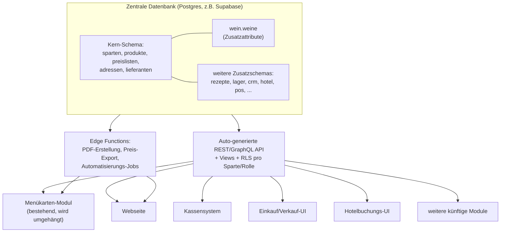
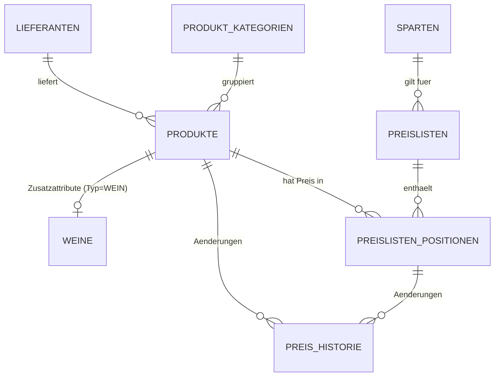

# Hoberg Gastro – Konzept für eine modulare Betriebssoftware

Status: Entwurf v1 | Datum: 2026-07-01

## 1. Ausgangslage

Hoberg betreibt mehrere Sparten unter einem Dach: Hotel, Restaurant, Catering,
Spezialitätenproduktion, Glaceherstellung, Störkoch. Ein erstes Modul
(Menükarten-System mit PDF-Export in CI und Web-Anzeige) existiert bereits
(Bolt.new). Ziel ist **keine Sammlung von Einzellösungen**, sondern ein System
mit **einer gemeinsamen Datenbasis**, auf die beliebig viele Module zugreifen –
neue Module sollen sich anschliessen lassen, ohne Daten zu duplizieren.

Erster konkreter Baustein: **Produktdatenbank Wein**, inkl. unterschiedlicher
Verkaufspreise pro Sparte (Restaurant, Catering, …) und einer sauberen
**Preis-Mutation** ausgehend von den Stammdaten.

## 2. Architekturprinzipien

1. **Stammdaten-first, Single Source of Truth** – ein Produkt (z. B. ein Wein)
   existiert genau einmal in der Datenbank. Module lesen/verändern diese
   Stammdaten, sie duplizieren sie nicht.
2. **Sparte ist ein Attribut, keine eigene Datenbank.** Hotel, Restaurant,
   Catering usw. sind Werte einer `sparten`-Tabelle, keine getrennten Systeme.
   Das erlaubt sparten-spezifische Preise/Sichtbarkeit bei gemeinsamen
   Produktdaten.
3. **API-first / Headless.** Jedes Modul (inkl. bestehendes Menükarten-Tool,
   künftige Website, Kassensystem) spricht über eine gemeinsame API
   (Postgres/Supabase REST & GraphQL + Views) mit der Datenbank. Kein Modul
   hält eigene Kopien von Produkt- oder Preisdaten.
4. **Erweiterbar statt starr.** Neue Produktarten (Speisen, Zutaten,
   Glaceartikel, Handelswaren) hängen sich als **Zusatztabellen** an eine
   generische `produkte`-Kerntabelle – analog zum Wein-Beispiel. Neue Module
   docken an dieselben Kern-Entitäten (Produkte, Preislisten, Adressen,
   Sparten) an.
5. **Jede Preisänderung ist nachvollziehbar.** Mutationen an Einkaufs- oder
   Verkaufspreisen werden protokolliert (wer, wann, alt → neu, warum),
   nicht überschrieben.
6. **Automatisierung über Events/Views, nicht über Spezialcode pro Modul.**
   Schnittstellen (POS, Website, Buchungsportale) docken über klar definierte
   Views, Funktionen und Webhooks an – das ist die Grundlage, um später
   Bereiche automatisiert zu verknüpfen (z. B. Lagerbestand → Bestellvorschlag,
   Kassenumsatz → Lagerabgang).

## 3. Modulübersicht

Alle Module teilen sich den Kern (Stammdaten, Produkte, Preislisten, Adressen,
Sparten). Die Tabelle zeigt, welche Kern-Entitäten jedes Modul nutzt bzw.
erweitert.

| Modul | Zweck | nutzt Kern-Entitäten | eigene Zusatzdaten (Beispiele) |
|---|---|---|---|
| **Stammdaten** (Kern) | zentrale Wahrheit für Produkte, Sparten, Lieferanten, Adressen | – | Sparten, Kategorien, Einheiten, MwSt-Sätze |
| **Produktverwaltung** | Erfassung/Pflege aller Artikel (Wein, Speisen, Zutaten, Glace, Handelsware) | Produkte | typ-spezifische Zusatztabellen (`weine`, später `speisen`, `glace_artikel`, …) |
| **Preislisten** | sparten-spezifische Verkaufspreise, automatische Ableitung aus Kalkulation | Produkte, Sparten | Preislisten, Preislistenpositionen, Preis-Historie, Kalkulationsregeln |
| **Einkauf** | Bestellungen, Wareneingang, Einkaufspreise | Produkte, Lieferanten | Bestellungen, Bestellpositionen, Wareneingänge |
| **Verkauf** | Angebote, Rechnungen, Aufträge (Catering-Events, Bankette) | Produkte, Preislisten, Adressen | Aufträge, Auftragspositionen, Rechnungen |
| **CRM / Adressverwaltung** | Kunden, Lieferanten, Interessenten, Kontakthistorie | Adressen | Firmen, Kontakte, Aktivitäten |
| **Hotelbuchungen** | Zimmerverfügbarkeit, Reservationen | Adressen, Preislisten (Zimmerkategorien als Produkte) | Zimmer, Reservationen, Belegungspläne |
| **Rezeptverwaltung** | Rezepte, Kalkulation über Zutatenpreise | Produkte (als Zutaten) | Rezepte, Rezeptpositionen, Nährwert-/Allergenangaben |
| **Lagerbewirtschaftung** | Bestände, Inventur, Mindestbestände je Standort/Sparte | Produkte, Sparten | Lagerorte, Lagerbestände, Bewegungen |
| **Interne Kommunikation** | Aufgaben, Schichtinfos, Ankündigungen | Adressen (Mitarbeitende) | Nachrichten, Aufgaben |
| **Kassensystem-Anbindung** | Verkaufsdaten importieren, Preise exportieren | Produkte, Preislisten | Mapping-Tabelle POS-Artikel ↔ Produkt, Verkaufsbelege |
| **Webseitenverwaltung / Menükarten** | öffentliche Darstellung, PDF-Export (bereits vorhanden) | Produkte, Preislisten | Menüaufbau/Layout, CI-Vorlagen |
| **Automatisierung / Integration Hub** | Schnittstellen, Webhooks, wiederkehrende Jobs | alle | API-Keys, Webhook-Log, Job-Historie |

## 4. Systemarchitektur (High Level)

Jedes Modul ist ein eigenes Frontend/Service, aber es gibt **eine** Datenbank
und **eine** API-Schicht. Damit landet z. B. eine Preisänderung in den
Stammdaten automatisch in Menükarte, Webseite und (später) im Kassensystem –
ohne manuellen Doppelaufwand.

## 5. Sparten-Konzept

`sparten` ist eine einfache Stammdatentabelle:

`HOTEL`, `RESTAURANT`, `CATERING`, `SPEZIALITAETEN`, `GLACE`, `STOERKOCH`
(erweiterbar, keine Codeänderung nötig für neue Sparten).

Ein Produkt (z. B. ein Wein) ist sparten-unabhängig in den Stammdaten erfasst.
Ob und zu welchem Preis es in einer Sparte erscheint, wird über eine
**Preisliste pro Sparte** gesteuert (siehe Abschnitt 7). So kann derselbe Wein:

- im Restaurant zu CHF 39.– im Glas/Flasche erscheinen,
- im Catering zu einem Pauschal-/Mengenpreis,
- im Hotel z. B. gar nicht (weil nicht gelistet) –

ohne dass er drei separate Produktstämme braucht.

## 6. Datenbankkonzept

### 6.1 Schema-Organisation

Postgres-Schemas trennen Fachbereiche, teilen sich aber Fremdschlüssel auf den
Kern:

- `core` – Sparten, Produkte, Kategorien, Lieferanten, Preislisten, MwSt
- `wein` – Zusatzattribute für Produkte vom Typ `WEIN`
- `crm` – Adressen, Firmen, Kontakte (Phase 3)
- `lager`, `einkauf`, `verkauf`, `rezepte`, `hotel`, `pos` – künftige Module,
  referenzieren `core.produkte` / `core.sparten` / `crm.adressen`

### 6.2 Namenskonventionen (verbindlich)

- Tabellen: `snake_case`, Plural (`produkte`, `preislisten`)
- Primärschlüssel: `id uuid default gen_random_uuid()`
- Fremdschlüssel: `<tabelle_singular>_id` (`produkt_id`, `sparte_id`)
- Zeitstempel: `created_at`, `updated_at` (immer `timestamptz`)
- Geldbeträge: `numeric(10,2)`, Währung separat vermerken (`waehrung`, default `CHF`)
- Jede fachliche Änderung an einem Preis läuft über eine Funktion/Trigger,
  **nie** durch stilles Überschreiben ohne Historieneintrag

### 6.3 Kern-ER-Diagramm

### 6.4 Kerntabellen (Phase 1 – siehe `db/phase1_stammdaten_wein_preise.sql`)

**`core.sparten`** – Betriebsbereiche (Hotel, Restaurant, Catering, …)

**`core.mwst_saetze`** – MwSt-Sätze mit Gültigkeitszeitraum (Sätze ändern
sich mit der Zeit, daher historisiert statt einfacher Prozentwert)

**`core.lieferanten`** – Weinhändler/Produzenten als Lieferant

**`core.produkt_kategorien`** – hierarchische Kategorien
(`Getränke > Wein > Rotwein`)

**`core.produkte`** – generische Produkt-Stammdaten für **alle** Artikeltypen
(`produkt_typ` als Diskriminator: `WEIN`, `SPEISE`, `ZUTAT`, `HANDELSWARE`,
`GLACE`, …). Enthält Artikelnummer, Bezeichnung, Einkaufspreis,
Basis-Einheit, Lieferant, MwSt, Status.

**`wein.weine`** – 1:1-Zusatztabelle zu `core.produkte` für alle
Wein-spezifischen Felder: Rebsorte(n), Jahrgang, Land/Region/Appellation,
Winzer, Farbe, Flascheninhalt, Alkoholgehalt, Süssegrad, Bio-Zertifizierung,
Allergene/Sulfite, Verkostungsnotiz, Trinktemperatur, Lagerfähigkeit.

→ **Muster für alle künftigen Produktarten**: neue Sparte/Produktart = neue
Zusatztabelle mit `produkt_id` als PK/FK, niemals eine Kopie von `produkte`.

**`core.preislisten`** – Preisliste pro Sparte mit Gültigkeitszeitraum und
Status (`ENTWURF`, `AKTIV`, `ARCHIVIERT`). Beispiel: "Weinkarte Restaurant
2026", "Preisliste Catering Sommer 2026".

**`core.preislisten_positionen`** – Verkaufspreis eines Produkts in einer
Preisliste, mit eigenem Gültigkeitszeitraum (→ Mutationen ohne Datenverlust:
alte Zeile bekommt `gueltig_bis`, neue Zeile wird eingefügt).

**`core.preis_historie`** – Audit-Log **jeder** Preisänderung
(Einkaufspreis in den Stammdaten **und** Verkaufspreise in Preislisten):
alter Wert, neuer Wert, wer, wann, Grund. Wird per Trigger automatisch
befüllt – Mutation ist damit strukturell erzwungen, nicht optional.

## 7. Preislogik im Detail (Wein-Beispiel)

1. **Einkaufspreis / Kalkulationsbasis** liegt in `core.produkte.einkaufspreis`
   – das ist der Stammdatenwert, den der Einkauf pflegt.
2. **Verkaufspreise pro Sparte** liegen in `core.preislisten_positionen`,
   je Sparte eine eigene aktive Preisliste. Ein Wein kann also gleichzeitig
   einen Restaurant-Preis und einen Catering-Preis haben, beide unabhängig
   voneinander veränderbar.
3. **Mutation:**
   - Ändert sich der Einkaufspreis in den Stammdaten → Trigger schreibt
     einen Eintrag in `core.preis_historie` und kann optional (Kalkulations-
     regel, z. B. Faktor 2.8 für Restaurant, Faktor 1.6 für Catering) einen
     **Preisvorschlag** für die betroffenen Preislisten-Positionen erzeugen.
   - Die eigentliche Übernahme des Vorschlags in die aktive Preisliste ist
     ein bewusster Freigabeschritt (kein automatisches Überschreiben von
     Kundenpreisen), wird aber ebenfalls historisiert.
4. **MwSt** wird pro Preislisten-Position referenziert (Restaurant vs.
   Take-away/Catering können unterschiedliche Sätze haben).
5. Dieses Muster (Stammpreis → sparten-spezifische Preisliste → Historie)
   gilt unverändert für alle künftigen Produktarten, nicht nur Wein.

## 8. Schnittstellen & Automatisierung

- **Interne API:** Supabase-generierte REST/GraphQL-API auf `core.*`-Tabellen
  und -Views, Zugriff über Row Level Security nach Sparte/Rolle gesteuert.
- **Bestehendes Menükarten-Modul (Bolt.new):** wird so umgehängt, dass es
  Produkte/Preise über die gemeinsame API aus `core.produkte` +
  `core.preislisten_positionen` liest statt eigene Daten zu halten. PDF- und
  Web-Ausgabe bleiben wie gehabt, nur die Datenquelle wird zentralisiert.
- **Kassensystem:** Mapping-Tabelle POS-Artikelcode ↔ `produkt_id`;
  Verkaufsbelege fliessen als Events zurück (Basis für spätere
  Lagerabgang-Automatisierung).
- **Automatisierungs-/Integrations-Hub:** Webhook-Log- und Job-Tabellen im
  Kern, damit neue Automatisierungen (z. B. "Preisliste PDF neu generieren,
  wenn sich eine Preislisten-Position ändert") einheitlich angebunden werden,
  statt pro Modul Spezialcode zu schreiben.

## 9. Rollen & Berechtigungen (Kurzform)

Rollenkonzept über Supabase Auth + RLS, grob:

- **Stammdaten-Pflege** (Einkaufspreise, Produktdaten): Einkauf/Admin
- **Preislisten-Freigabe** (Verkaufspreise je Sparte): Sparten-Verantwortliche
- **Lesezugriff** je Modul/Sparte: entsprechendes Personal
- **Reine Leserechte** für Webseite/Kassensystem (technische Service-Accounts)

## 10. Roadmap

1. **Phase 1 (jetzt):** Kern-Stammdaten + Produktdatenbank Wein +
   Preislisten Restaurant/Catering + Preis-Historie (siehe SQL-Datei).
2. **Phase 2:** Bestehendes Menükarten-Modul auf die neue Datenbank umstellen
   (statt Eigendaten), inkl. automatischem PDF-Export aus Preislisten.
3. **Phase 3:** Einkauf, Lager, CRM/Adressverwaltung.
4. **Phase 4:** Hotelbuchungen, Kassensystem-Anbindung, Rezeptverwaltung,
   interne Kommunikation.
5. **Laufend:** Automatisierungs-Hub ausbauen (Bestellvorschläge,
   Kassenabgleich, Website-Sync).

## 11. Technologie-Empfehlung

**Postgres via Supabase**: eine Datenbank für alle Module, automatisch
generierte REST/GraphQL-API, Row Level Security für die Sparten-/Rollentrennung,
Auth, Storage (Produktbilder, PDFs) und Edge Functions (PDF-Erstellung,
Automatisierungsjobs) aus einer Hand. Das bestehende Bolt.new-Menükarten-Tool
lässt sich darauf umstellen, ohne die UI verwerfen zu müssen – nur die
Datenquelle wechselt von "eigene Tabelle" zu "gemeinsame Stammdaten".

Konkreter nächster Schritt: Supabase-Projekt für Hoberg Gastro anlegen und
`db/phase1_stammdaten_wein_preise.sql` als erste Migration einspielen.
